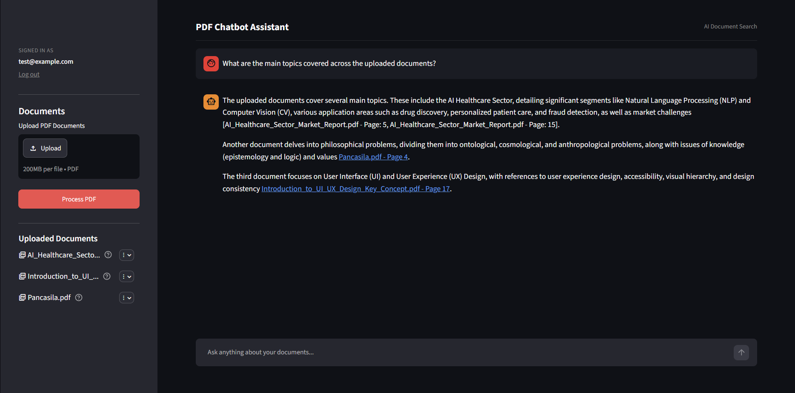

# PDF Q&A Chatbot (Conversational RAG)

A web-based conversational Retrieval-Augmented Generation (RAG) assistant built with **Streamlit**, **Google Gemini API**, **Supabase** (Auth, Storage, and pgvector Vector Store), and **SentenceTransformers**.

The application allows authenticated users to upload, manage (rename/delete), and search through PDF documents with multi-turn conversational AI context, automatic query rewriting, and interactive page-level citations.



---

## Features

- **User Authentication**: Secure user sign-up, sign-in, and session management using Supabase Auth.
- **Document Management**:
  - Multi-file PDF upload directly via the Streamlit interface.
  - PDF storage in Supabase Storage (`pdfs` bucket) isolated per user.
  - Document renaming and deletion with synchronized storage and database updates.
  - SHA-256 content hashing to skip duplicate document processing and update modified files.
- **Vector Search & Embeddings**:
  - Text extraction page-by-page using `pypdf` and chunking with LangChain's `RecursiveCharacterTextSplitter`.
  - Embeddings generated using `sentence-transformers` (`all-MiniLM-L6-v2`).
  - Vector similarity search powered by Supabase PostgreSQL (`pgvector` / `match_documents` RPC).
- **Conversational RAG & Query Rewriting**:
  - Follow-up questions are automatically rewritten into standalone search queries using `gemini-2.5-flash` and conversation history.
  - Answers are strictly grounded in retrieved PDF context to prevent hallucinations.
- **Clickable Signed Citations**: Assistant responses include clickable citation links (`[filename.pdf - Page X]`) generated via signed Supabase URLs targeting the exact PDF page.
- **Retrieval Evaluation Suite**: Automated benchmark script (`evaluate_rag.py`) to measure `Hit@k` retrieval accuracy across test question sets.
- **CLI & ChromaDB Support**: CLI ingestion and local vector database support (`chromadb.PersistentClient`) in `pdf_reader.py`.

---

## Project Structure

```text
├── app.py                  # Main Streamlit web application entry point
├── login.py                # Streamlit login page component
├── pages/
│   └── signup.py           # Streamlit signup page component
├── pdf_reader.py           # RAG logic, text extraction, query rewriting, Supabase & ChromaDB handlers
├── embedding.py            # SentenceTransformer model wrapper (all-MiniLM-L6-v2)
├── supabase_client.py      # Supabase client initialization using Streamlit secrets
├── evaluate_rag.py         # Automated evaluation script testing retrieval accuracy (Hit@k)
├── style.css               # Custom CSS styling for the Streamlit frontend
├── PRD.md                  # Product Requirement Document
├── documents/              # Directory for local sample PDFs (used by CLI mode)
├── .streamlit/
│   ├── config.toml         # Streamlit UI configuration
│   └── secrets.toml        # Supabase API credentials (URL & Key)
└── .env                    # Environment variables (Google Gemini API Key)
```

---

## Dependencies

- **Python**: `3.9+`
- **Frontend & Web Framework**: `streamlit`
- **LLM API**: `google-genai` (Gemini API)
- **Database & Auth**: `supabase`
- **Embeddings & NLP**: `sentence-transformers`, `langchain-text-splitters`
- **PDF Processing**: `pypdf`
- **Vector Store (Local/CLI)**: `chromadb`
- **Environment & Utilities**: `python-dotenv`

---

## Setup & Configuration

### 1. Environment Setup

Clone the repository and install requirements inside a virtual environment:

```bash
# Create virtual environment
python -m venv .venv

# Activate virtual environment
# On Windows (PowerShell):
.venv\Scripts\activate
# On Linux/macOS:
source .venv/bin/activate

# Install dependencies
pip install streamlit google-genai supabase sentence-transformers langchain-text-splitters pypdf chromadb python-dotenv
```

### 2. Configuration Files

#### A. Google Gemini API Key (`.env`)
Create a `.env` file in the root directory:
```env
GEMINI_API_KEY=your_gemini_api_key_here
```

#### B. Supabase Credentials (`.streamlit/secrets.toml`)
Create `.streamlit/secrets.toml` with your Supabase credentials:
```toml
SUPABASE_URL="https://your-supabase-project.supabase.co"
SUPABASE_KEY="your-supabase-publishable-or-anon-key"
```

### 3. Supabase Backend Requirements

The application expects the following setup in your Supabase project:
- **Storage Bucket**: A bucket named `pdfs` with appropriate upload/read policies.
- **Table (`documents`)**: Table containing columns `id`, `user_id`, `content`, `embedding` (vector), `source`, `page`, and `content_hash`.
- **RPC Function (`match_documents`)**: PostgreSQL function taking `query_embedding` and `match_count` parameters to return matching document rows sorted by similarity.

---

## Usage

### Running the Web Application (Streamlit)

Start the main application:

```bash
streamlit run app.py
```

1. Open your browser at `http://localhost:8501`.
2. Sign up for a new account or log in with existing credentials.
3. Upload PDF documents using the sidebar and click **Process PDF**.
4. Start chatting with your documents in the main chat feed.

### Running Retrieval Evaluation

To test retrieval recall metrics (`Hit@k`) using the evaluation dataset in `evaluate_rag.py`:

```bash
python evaluate_rag.py
```

*Note: Requires valid test user credentials set inside `evaluate_rag.py` and target documents uploaded to Supabase.*

### Running CLI Mode (Local ChromaDB)

To run the command-line interface using local files in `documents/` and local ChromaDB storage:

```bash
python pdf_reader.py
```

---

## Notes & Architecture Details

- **Grounding**: The assistant is strictly instructed to answer only from retrieved document chunks and outputs `"I don't know based on the provided document."` when the information is unavailable.
- **Query Rewriting**: Contextual follow-up questions are rewritten into standalone search queries via `gemini-2.5-flash` before vector retrieval.
- **Clickable Page References**: Document citations automatically convert into signed URLs with page anchors (`#page=N`) to open PDFs directly at the relevant page.